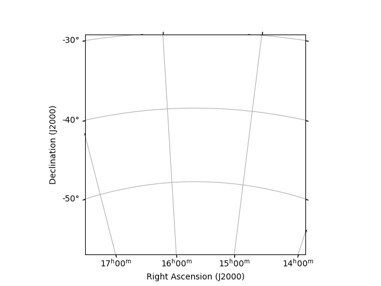
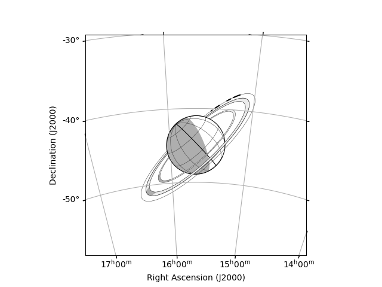

# `planetviewer`: Visualization Utilities for Solar System Observers 

`planetviewer` is a Python-based planetary geometry viewer based on the NASA 
PDS Ring-Moon Systems Node (available 
[here](https://pds-rings.seti.org/tools/)). It incorporates the functionality 
of both Matplotlib and Astropy as detailed below. It is integrated with 
Astropy's `Angle` and derived objects like `Longitude`, `Latitude`, and 
`SkyCoord` along with its `units` module. Most of the functions and methods are 
decently described in their docstrings, but I'll provide some overviews and a 
few examples here.

## Installation
Here are some installation instructions for the average Anaconda user; if 
you're more advanced I'm sure you can figure it out from here. (Note: in the
instructions below I will assume that you are using a virtual environment named 
`myenv`.) I've tested this using Python 3.10.
1. Activate your virtual environment:<br>
    `% conda activate myenv`
2. Install the `planetviewer` package and its dependencies:<br>
    `% python -m pip install git+https://github.com/zachariahmilby/planet-viewer.git`

You're now ready to use the `planetviewer` package!

## SPICE Kernels

`planetviewer` use NASA's SPICE system for ephemeris calculations. The 
necessary data files for these computations (called "kernels") will be 
automatically downloaded and kept up-to-date. The first time you load the 
SPICE kernels using `load_spice_kernels()`, all necessary kernels will be 
downloaded to your system. Everytime you subsequently run 
`load_spice_kernels()`, the system will check to see if any have been updated 
and will download any updated kernels. Depending on your Internet connection, 
this can take tens of seconds or more to complete, so if you are running a 
script frequently (for instance, you are making a plot and frequently making 
minor changes then regenerating it to see the result), you can prevent this 
check by supplying the keyword argument `download=False`.

> **NOTE**<br>
> The first thing you will have to do to use (almost) any function or method in
> `planetviewer` is load the SPICE kernels with the function 
> `load_spice_kernels()`.

## Observers
The choice of observer/observatory can be one of three types:
1. Any planetary body defined in SPICE (major planets, minor planets or 
satellites),
2. A spacecraft, or
3. A ground-based observatory on Earth.

Available spacecraft can be found using the function 
`get_available_spacecraft`. Available ground-based observatories can be found 
using the function `get_available_observatories`. Each of these functions 
returns a list with the names of the available locations.

## Times
Observation epochs (the time of an observation at the observer) must be 
provided as Astropy `Time` objects.

## Ephemeris Calculations
The fundamental object in `planetviewer` is `Planet`. You can choose from any 
Solar System planet, dwarf planet or satellite known to the SPICE system. To 
create a planet object, simply provide its name:

```
from planetviewer import Planet
planet = Planet('Jupiter')
```

This object has a variety of built-in methods which allow you to calculate 
observer-dependent ephemeris information for the planet. A lot of this can of 
course be done using JPL Horizons (and/or its implementation in Astroquery). 
However, a part of my porting of the PDS Ring-Moon Systems Node Planet Viewers 
was recreating all of the various ephemeris information provided in the output.
These methods are also often used internally to produce the visualizations 
detailed below.

> **NOTE**<br>
> I don't believe in west longitudes. Neither does SPICE. All longitudes 
> returned by methods or otherwise reported from this package are east 
> longitudes. I wish I could change the definition of the north pole on planets
> like Venus and Uranus, but I'll save that for another time. As a Boulder 
> mom's bumper sticker might say, "be the change you want to see in the world."

### Example
Say you wanted to know the planet's right ascension and declination as observed 
from the Keck Observatory on the summit of Maunakea on June 8, 2021 at 14:00 
UTC. The method `get_skycoord()` will return the J2000 position of the planet 
as an Astropy `SkyCoord` object. You just need to provide the name of the 
observer (the Earth observatory site, spacecraft or SPICE ephemeris object; in 
this case, `'Keck'`) and the time of the observation as an Astropy `Time` 
object:

```
from astropy.time import Time
from planetviewer import load_spice_kernels, Planet

load_spice_kernels()

time = Time('2021-06-08 14:00')
observer = 'Keck'

planet = Planet('Jupiter')
coord = planet.get_skycoord(time=time, observer=observer)
```

`coord` is an Astropy `SkyCoord` object of the apparent position of Jupiter. In 
this example, it is:
```
<SkyCoord (ICRS): (ra, dec) in deg
    (333.99971902, -11.73147553)>
```

Almost every method requires the fundamental arguments `time` (as an Astropy 
`Time` object) and `observer` (as a string). Other methods have additional 
arguments detailed in their docstrings. See the table below for a summary of 
each method.

### Ephemeris Calculation Methods
The following table lists all of the ephemeris methods available in the 
`Planet` object. These should calculate all of the information (and more) 
returned by the various PDS planet viewers. See each method's docstring for 
specifics on arguments and outputs.

> **NOTE**<br>
> These values may differ slightly from those reported by the planet viewers. 
> They frequently used different aberration correction like 'LT' while I used 
> 'LT+S' following the advice given in the SPICE documentation.

| Method                                    | Description                                                                                                 |
|:------------------------------------------|:------------------------------------------------------------------------------------------------------------|
| `get_ra`                                  | Get J2000 right ascension.                                                                                  |
| `get_dec`                                 | Get J2000 declination.                                                                                      |
| `get_skycoord`                            | Get J2000 sky coordinate (RA/Dec).                                                                          |
| `get_offset`                              | Get offset between this object and another `SkyCoord` object.                                               |
| `get_sub_observer_latitude`               | Get apparent sub-observer latitude on the planet.                                                           |
| `get_sub_observer_longitude`              | Get apparent sub-observer longitude on the planet.                                                          |
| `get_subsolar_latitude`                   | Get apparent sub-solar latitude on the planet.                                                              |
| `get_subsolar_longitude`                  | Get apparent sub-solar longitude on the planet.                                                             |
| `get_phase_angle`                         | Get the phase angle at the sub-observer point.                                                              |
| `get_distance`                            | Get the distance from a SPICE ephemeris object to the object's barycenter.                                  |
| `get_ring_subsolar_latitude`              | Get the sub-solar latitude on the rings (the same as the planet's sub-solar latitude).                      |
| `get_ring_subsolar_latitude_range`        | Get the range in sub-solar latitude on the rings due to the apparent angular size of the Sun.               |
| `get_ring_plane_opening_angle`            | Get the ring plane opening angle (the same as the planet's sub-observer latitude).                          |
| `determine_if_rings_illuminated`          | Determine if the rings appear illuminated to the observer.                                                  |
| `get_ring_center_phase_angle`             | Get the ring phase angle (the same as the phase angle at the sub-observer point).                           |
| `get_ascending_node_longitude`            | Get the planetographic longitude of the ascending node of the body's equator on the J2000 frame equator.    |
| `get_ring_subsolar_longitude`             | Get the sub-solar longitude measured relative to the ring plane ascending node.                             |
| `get_ring_sub_observer_longitude`         | Get the sub-observer longitude measured relative to the ring plane ascending node.                          |
| `get_sun_target_distance`                 | Get the distance from the Sun to the object's barycenter.                                                   |
| `get_observer_target_distance`            | Get the distance from the observer to the object's barycenter.                                              |
| `get_light_travel_time`                   | Get the light travel time between a SPICE ephemeris object and the object's barycenter.                     |
| `get_latlon_sky_coordinates`              | Get the apparent RA/Dec of a latitude/longitude point on the object's surface.                              |
| `get_longitude_line_coordinates`          | Get the apparent RA/Dec of an entire meridian.                                                              |
| `get_latitude_line_coordinates`           | Get the apparent RA/Dec of an entire parallel.                                                              |
| `get_limb_sky_coordinates`                | Get the apparent RA/Dec of an object's limb.                                                                |
| `get_terminator_sky_coordinates`          | Get the apparent RA/Dec of an object's terminator.                                                          |
| `get_dayside_sky_coordinates`             | Get the apaprent RA/Dec of an object's dayside disk (the region between the dayside limb and terminator).   |
| `get_shadow_intersection_sky_coordinates` | Get the apparent RA/Dec of the intersection of another object's shadow on the apparent disk of this object. |
| `get_angular_radius`                      | Convert the object's mean equatorial radius to angular radius on the sky.                                   |
| `get_angular_offset_between_times`        | Calculate the RA/Dec offset necessary to shift this object's sky coordinates between two times.             |
| `parse_fov`                               | Convert an angle, length or scalar to an angular field-of-view.                                             |
| `draw`                                    | A convenience function to draw a planet in an Astropy `WCSAxes` axis.                                       |

## Visualization with Matplotlib
The primary purpose of this package is to provide a convenient way to visualize 
the appearance of a Solar System object to an observer at a particular time. 
I imagine most people will use this to generate figures for papers or 
presentations. Astropy provides a variety of convenient extensions to 
Matplotlib with produce excellent astronomical graphics, and the methods I've 
created here are designed to interface with both Astropy's extensions.

`Planet` objects can be drawn in parts (using the various functions described 
below) or using the convenient `draw` method. Rings can be drawn for Outer 
Solar System planets, and Neptune's Adams ring arcs can also be drawn. 
Available rings can be found in the `rings` property of the `Planet` class.

The World Coordinate System (WCS) projection and corresponding transforms are 
the core of the visualization system. Several functions conveniently calculate 
these for you (see below).

Ths visualization methods will also incorporate any changes you make to 
Matplotlib's runtime configuration (rcParams), so you can style the graphics 
however you'd like.
> **CAUTION**
> There is a [known bug](https://github.com/astropy/astropy/issues/15344) 
> between Astropy's extensions to Matpltolib and pgf rendering. This will cause 
> an exception if you try to use pgf. Hopefully this will be fixed soon.

### Plotting Functions
The following table lists each of the plotting functions available. Their 
individual docstrings provide more detailed instructions for their use.

| Function                        | Description                                                                                      |
|:--------------------------------|:-------------------------------------------------------------------------------------------------|
| `plot_limb`                     | Draw the planet's apparent limb.                                                                 |
| `plot_disk`                     | Draw the planet's apparent disk as a filled polygon.                                             |
| `plot_nightside`                | Draw the planet's apparent night side as a filled polyon.                                        |
| `plot_primary_shadow`           | If the planet is a moon, draw the primary planet's shadow if it intersects with the moon's disk. |
| `plot_latlon`                   | Draw a latitude or longitude line.                                                               |
| `plot_ring`                     | Draw a particular ring.                                                                          |
| `place_ring_pericenter_markers` | Place markers at eccentric ring pericenters (applies only to some rings of Uranus).              |
| `plot_arc`                      | Draw ring arc (applies only to Neptune's Adams ring).                                            |
| `place_label`                   | Place a label at a given coordinate.                                                             |
| `set_standard_axis_labels`      | Set standard J2000 axis labels.                                                                  |
| `set_standard_axis_limits`      | Ensures axis limits match the chosen center and FOV.                                             |
| `convert_to_relative_axis`      | Convert axis from absolute RA/Dec to relative angle from the center.                             |

### Example
Here's how to produce a figure with a WCS axis centered on Neptune as observed 
from Triton June 8, 2021 at 14:00 UTC with a 30 degree field of view:

```
import matplotlib.pyplot as plt
from astropy.coordinates import Angle
from astropy.time import Time

from planetviewer import (load_spice_kernels, Planet, make_wcs, 
                          set_standard_axis_limits, set_standard_axis_labels)

time = Time('2021-06-08 14:00')
observer = 'Triton'
planet = Planet('Neptune')

center = planet.get_skycoord(time=time, observer=observer)
fov = planet.parse_fov(time=time, observer=observer, fov=Angle(30, unit='deg'))
wcs = make_wcs(center=center, fov=fov)

fig, axis = plt.subplots(subplot_kw=dict(projection=wcs))
plt.grid()  # turn on RA/Dec sky grid

set_standard_axis_limits(axis)
set_standard_axis_labels(axis)
```

The last two functions are convenience functions to make sure the plot looks 
the way it should. `set_standard_axis_limits` makes sure the axis limits are 
set to the FOV you chose (this can change when different objects are drawn).
`set_standard_axis_labels` sets the approrpriate axis labels. Here's what this 
axis looks like:



Now, you can add a plot of Neptune with `planet.draw(axis=axis, time=time, 
observer=observer)`. This will draw Neptune with a latitude/longitude grid 
spaced by 30° and all of its rings. You can also draw only specific rings or no
rings (as detailed in the `Planet` docstring.) Notice how it draws the prime 
meridian as a darker black line, shades the night side and even projects 
Neptune's shadow onto the rings. It also draws the Adams ring arcs. 



Now, let's add some satellites.
```
satellites = ['Proteus', 'Larissa', 'Galatea', 'Despina', 'Thalassa']
for moon in satellites:
    satellite = Planet(moon)
    satellite.draw(axis=axis, time=time, observer=observer)
```


It looks like most of them are visible in the 30 degree FOV at the 
observation time. Let's modify the above code block to label each of the 
satellites using Matplotlib's `annotate` function.

```
transform = axis.get_transform('world')
satellites = ['Proteus', 'Larissa', 'Galatea', 'Despina', 'Thalassa']
for moon in satellites:
    satellite = Planet(moon)
    coord = satellite.get_skycoord(time=time, observer=observer)
    axis.annotate(moon, xy=(coord.ra.deg, coord.dec.deg), xycoords=transform,
                  annotation_clip=True)
```


There are of course many additional plotting options. For example, if I were 
making this plot, I might sort all of the objects I want to plot by distance to 
the observer (furthest to closest) and plot them in that order, that way any 
objects which should be behind Jupiter are drawn first. These distances can be 
calculated with each `Planet` object's `get_observer_target_distance` method.
